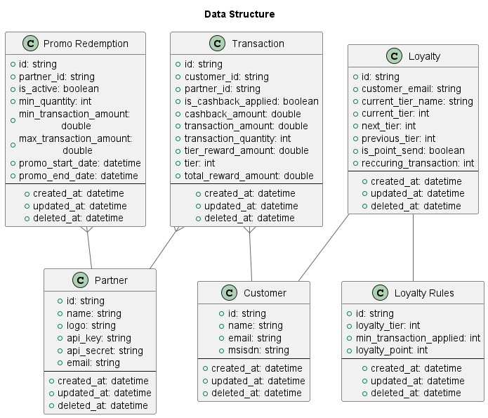

# kezbek-backend

Kezbek is a type of application that allows users to earn rewards or cash back when they make purchases at participating merchants. These apps often have partnerships with a variety of retailers, restaurants, e-commerce and other businesses, and offer users a percentage of their purchase price back in the form of cash or other rewards.

## Feature

- Loyalty program for customer
- Reward for customer
- Coupon Cashback for customer
- Seemless integration with merchant (partner)
- Seemless integration with payment gateway (e-wallet) by customer MSISDN


- [*]CMS for merchant
- [*]Report for invoice and transaction for merchant
- [*]Check loyalty point for customer

**NOTE:** [*] is additional feature

Currently, we are integrating with dummy payment gateway and dummy merchant

## ERD


## Architecture

## How to run it locally

before please install [docker engine](https://docs.docker.com/engine/install/) and [docker compose](https://docs.docker.com/compose/install/)

install [latest nodeJS](https://nodejs.org/en/download/)

```bash
# run docker compose to setup the stacks that need by app

docker compose -f deploy/docker-compose.yml up -d

# Run the app with docker
docker build -f ./Deploy/Dockerfile -t kezbek-backend .

docker run -p 3000:3000 kezbek-backend

# development
$ npm run start

# watch mode
$ npm run start:dev
```

## How to contribute

## Library
